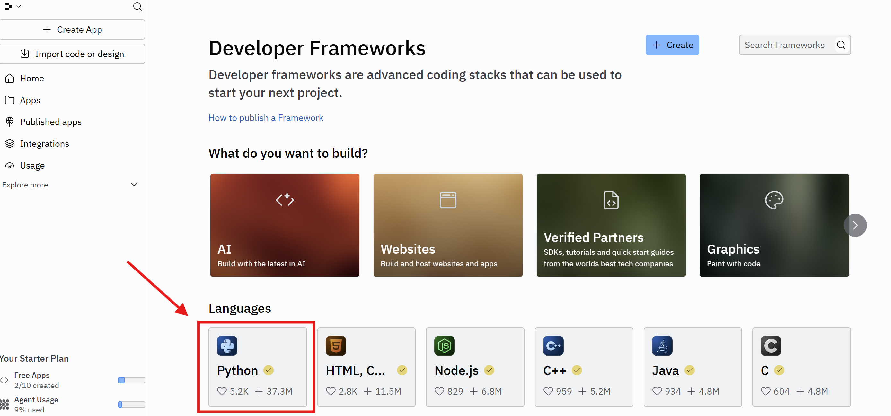
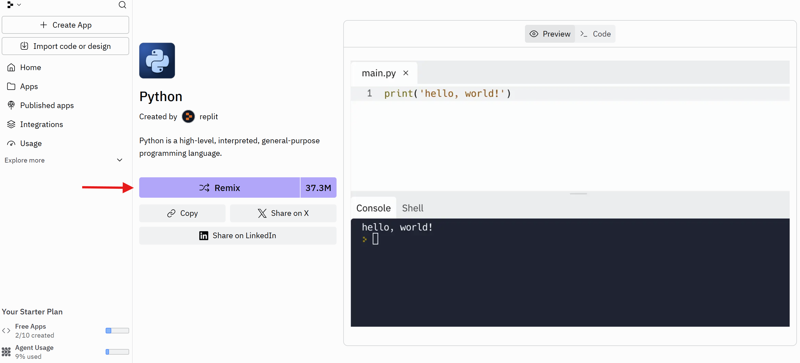
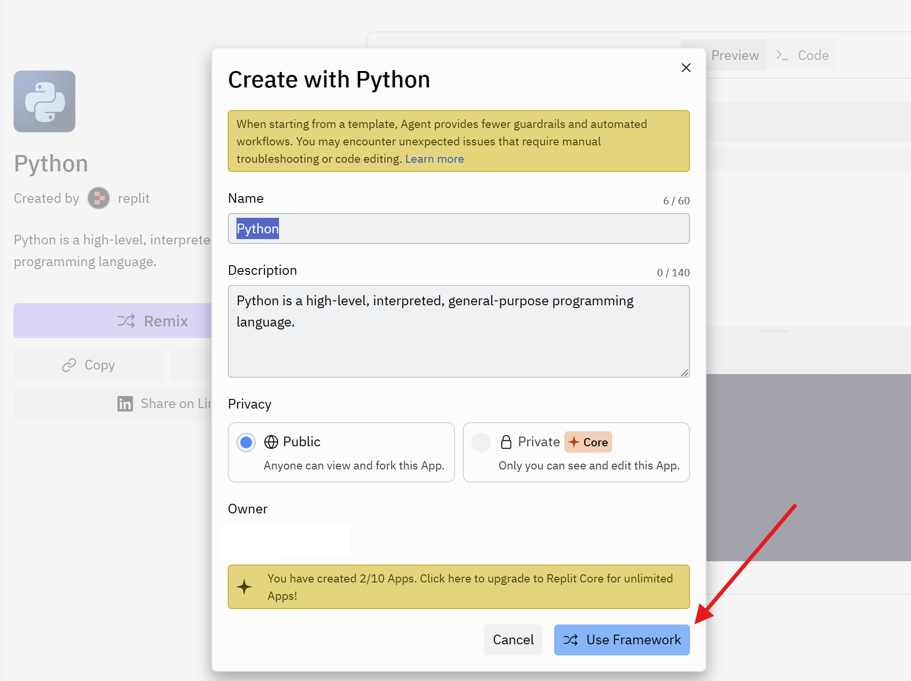
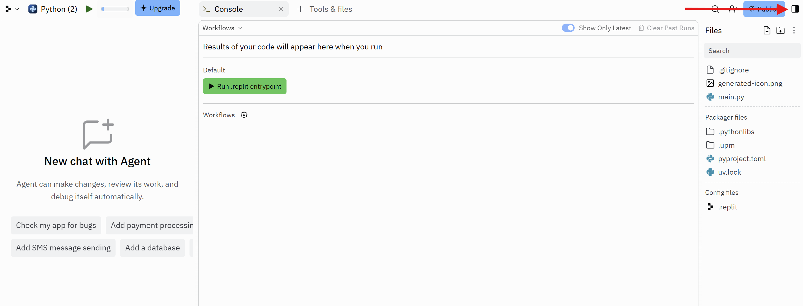
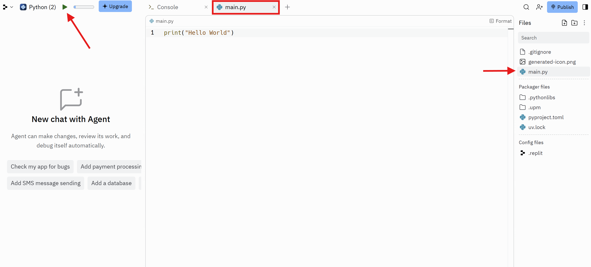
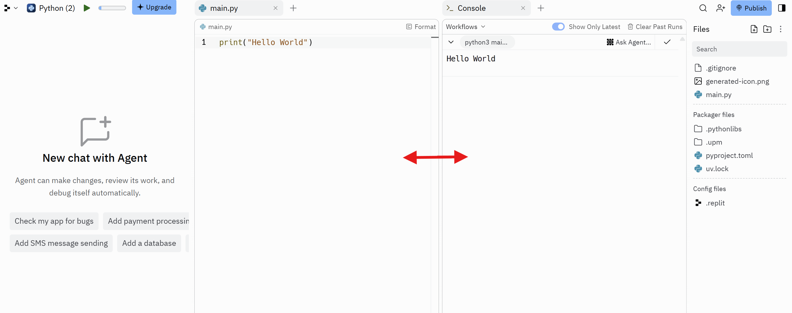

# Replit Setup Guide - Updated for New Interface

**Last Updated:** November 15, 2025

Replit changed their interface in September 2025. Follow these updated steps instead of the screenshots in Chapter 2 of the book.

---

## Step 1: Find Python in the Templates

1. Go to **https://replit.com/templates**
2. Scroll down to the **"Languages"** section
3. Click on the **Python** box (blue Python logo)

---

## Step 2: Click REMIX (CRITICAL!)

After clicking Python, you'll see the template description page.

**🔴 IMPORTANT:** Look for the big purple **"Remix"** button

**Click the Remix button.**

### ⚠️ This is the step everyone misses!

Just viewing the template won't let you code - you **MUST** click Remix to create your own editable copy.

---

## Step 3: Name Your Project

A dialog box appears: "Create with Python"

1. Enter a project name (or keep the default "Python")
2. Leave it set to **Public**
3. Click the blue **"Use Framework"** button (bottom right)

---

## Step 4: Your Workspace Opens

After a few seconds, you'll see your workspace. Here's the layout:

**What you're seeing:**
- **Left side:** AI Agent chat (you can ignore this)
- **Center:** Console tab is showing
- **Right side:** Files panel
- **Top left:** Green Run button (top left next to "Python (2))

---

## Step 5: Open the Code Editor

To see and edit your code:

1. Look at the **Files** panel on the **right side**
2. Click on **main.py** in the file list or create new your own .py file
3. The **main.py** tab will open in the center
4. You'll see: `print("Hello World")`
5. This is your code editor - you can now type here!

Notice in the Files panel (right), **main.py** is highlighted.

---

## Step 6: Run Your Code

1. Click the green **Run** button (top left, next to "Python (2)")
2. Click the **Console** tab at the top to see the output
3. You should see: `Hello World`

---

## Step 7: Split Screen View (Recommended!)

Here's the easiest way to see both your code AND console at the same time:

**Simply drag the Console tab down below the main.py tab.**

This creates a split screen so you can write code on left and see output on right - much easier than clicking back and forth between tabs!

---

## ✅ You're All Set!

### The Key Concept

The new Replit uses **tabs** (like a web browser), but you can arrange them how you want.

### Basic Workflow

1. Drag **Console** tab down to create split screen
2. Write code in **main.py** (top)
3. Click **Run** button
4. See results in **Console** (bottom)

### To Create or Edit Files

- Click filenames in the **Files panel** (right side)
- Each file opens as a tab in the center
- Look for the "+" icon in Files panel to create new files

---

## 🔄 What Changed from the Book?

| Book Says | New Interface |
|-----------|---------------|
| Click "+ Create" → Select Python | Go to templates → Click Python → Click **Remix** |
| Files panel on left | Files panel on **right** |
| Split screen by default | Must drag Console tab down to split |
| Fixed layout | Tab-based layout (like browser) |

---

## 💡 Quick Tips

- **Can't find Console?** Look for tabs at the top center
- **Can't see files?** Click "Tools & files" tab on the right
- **Code won't run?** Make sure you clicked the file first, then Run
- **Want to add new file?** Look for "+" icon in Files panel (right)

---

## 📚 Need More Help?

- [Back to Main Repo](https://github.com/Grandpa-Coder/python-for-people-who-cant-code)
- [Interactive Quizzes](https://grandpa-coder.github.io/python-for-people-who-cant-code)
- [Report an Issue](https://github.com/Grandpa-Coder/python-for-people-who-cant-code/blob/main/ERRATA.md)

---

**From here, everything in the book works exactly as written!** 🎉
